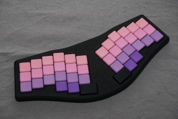
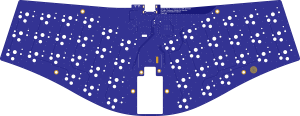
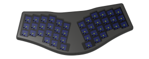

# Osprey

The Osprey is a column staggered 40% wireless ergonomic keyboard. PCB and 3D-printable case are both open source (CERN OHL Permissive), and so is the software (MIT) as it is designed to run the [ZMK firmware](https://github.com/zmkfirmware/zmk).

     

The board was designed to be an elegant and sleek unibody keyboard, without sacrificing typing comfort or portability. While the enclosure has raised edges to hide the keyswitches for a more refined look, it is still as slim as possible with Choc v1 switches, leading to a total thickness of about 16 mm from bottom to keycap top, if used with MBK keycaps.

The PCB is "floating" inside the case and the switches are held in-place by a 1.2 mm FR4 plate, which is sandwiched between case top and bottom half.

## Hardware
The Rev A is the first board in the Osprey family, using an nRF52840 chip, running in full DC-DC mode for highest possible battery life. A Texas Instruments BQ24075 battery management chip ensures reliable charging, while a MAX17048 fuel gauge allows for accurate battery status measurements which are communicated to your PC via Bluetooth.

The PCB is designed for Kailh Choc v1, which can be hot-swapped, and does not need any stabilizers - the largest key is 1.5u for the thumbs.

The PCB has connectors to connect either an Alps RKJXU1210006 (also known as PSP-3000 thumbstick) or a Cirque TM023023 touchpad - Both are not yet supported firmware-side and by the case design, but the PCB is ready for either.

You will also need a 502030 battery (20 x 30 x 5 mm), which usually come between 200 and 250 mAh of capacity. The board uses a JST ACH low profile connector, so you will need either a JST ACH or Molex Pico EZmate cable to crimp/solder to the battery to connect it to the PCB - please be wary of the pinout and do not connect a wrong polarity battery, as that would destroy the PCB.

It was prototyped at PCBway and turned out great. Other manufacturers should be able to make sense of the files I attached and solder these PCBs, but it is untested so order there at your own risk. 

### Files needed for ordering the PCB:

- Order in 1.6mm FR4, ENIG finish
- [Gerber Files](osprey_rev_a/fab/osprey_rev_a-GERBER.zip)
- [BOM file](osprey_rev_a/fab/osprey_rev_a_BOM.xlsx)
- [POS file](osprey_rev_a/fab/osprey_rev_a-bottom-POS.csv)

  

### Files needed for ordering the plate:

- Order in 1.2mm FR4, finish does not matter
- [Gerber Files](osprey_plate/fab/osprey_plate.zip)

  

## Enclosure
I have attached step and 3mf files of the latest enclosure prototype - the case is still work in progress, as it lacks capability of adding thumbstick or touchpad. It is, however, tested and works fine for regular keyboard use. The enclosure is designed for [Ruthex M2 threaded inserts](https://www.ruthex.de/products/ruthex-gewindeeinsatz-m2-70-stuck-rx-m2x4-messing-gewindebuchsen) and M2x8 cylindrical head screws with flat TORX head (ISO 14580) - 9 piece each. 7 3M rubber bumpons with 7.9 mm diameter are used as feet. Other inserts, screws and bumpons may work but are untested.
- [Top enclosure, step](osprey_enclosure/osprey_enclosure_top.step)
- [Bottom enclosure, step](osprey_enclosure/osprey_enclosure_bot.step)
- [Top enclosure, 3mf](osprey_enclosure/osprey_enclosure_top.3mf)
- [Bottom enclosure, 3mf](osprey_enclosure/osprey_enclosure_bot.3mf)

  

## Software
As mentioned earlier, the board is designed to run the open source ZMK firmware. My current firmware config can be found in my [ZMK config](https://github.com/ebastler/zmk-config/tree/osprey-a/config/boards/arm/osprey) repository. Since the MAX17048 needs a not-yet-merged pull request (and some manual fixes applied to it) it points towards a custom branch on a ZMK fork, not towards the official repository. This board can not (yet) be built from ZMK main branch. The current version is broken and softbricks the board!

I am using an Adafruit Bootloader, a readily compiled one can be downloaded from the [github actions in my fork of their repository](https://github.com/ebastler/Adafruit_nRF52_Bootloader/actions). This needs to be flashed with a J-Link, Black Magic Probe or modified STlink v2 using a TC2030 flashing header.

## Thanks
 - [PCBWay](https://www.pcbway.com/) for the top notch quality sponsored PCBs - couldn't have done it without you!
 - [propagandalf](https://github.com/propagandalf1) for the 3D printed cases - thank you very much!